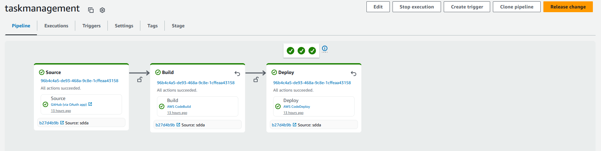
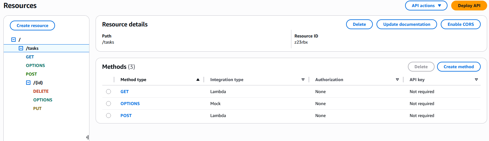
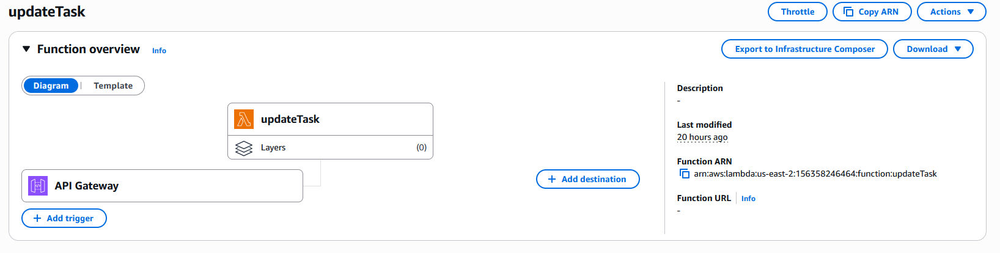
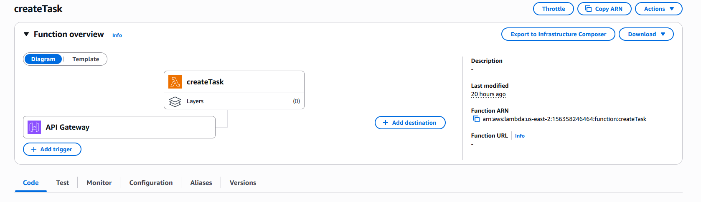
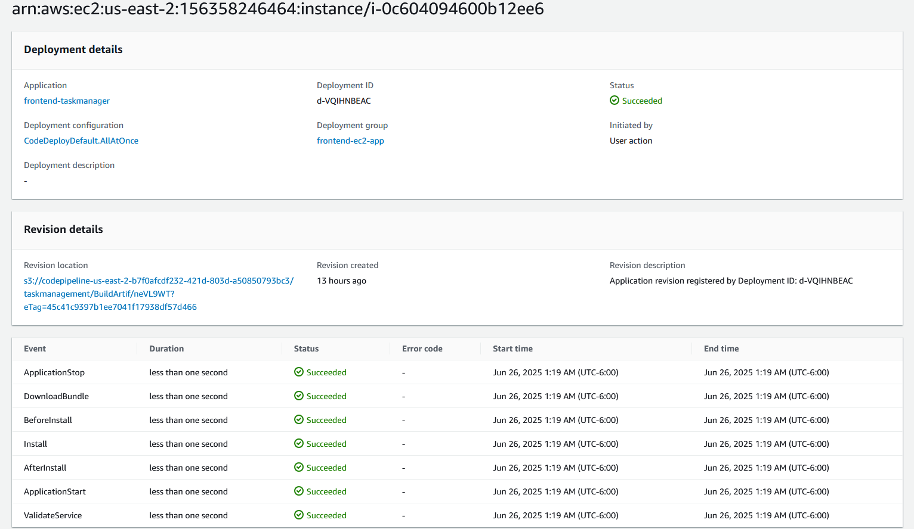
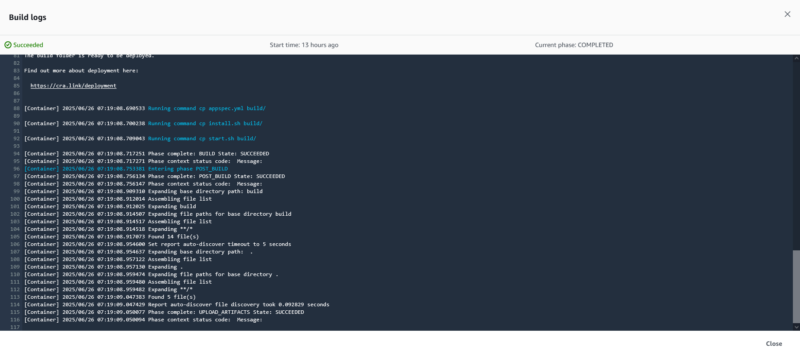

# Task Manager - Fullstack App en AWS (React + EC2 + Lambda)

Aplicación web para la gestión de tareas, desarrollada con **React** como frontend y una arquitectura **serverless + EC2** en AWS. Permite realizar operaciones CRUD sobre tareas, integrando servicios como **EC2**, **Lambda**, **DynamoDB**, **API Gateway**y **CodePipeline**.

La aplicación está desplegada públicamente y accesible desde:

[http://3.148.235.61:3000/](http://3.148.235.61:3000/)

---

## Tecnologías utilizadas

- **Frontend**: React (Create React App), Bootstrap
- **Backend**: AWS Lambda (Node.js)
- **Base de datos**: Amazon DynamoDB
- **API REST**: AWS API Gateway
- **Servidor web**: Amazon EC2 (para servir el frontend)
- **CI/CD**: AWS CodePipeline + CodeBuild + CodeDeploy
- **Logs y monitoreo**: AWS CloudWatch

---

## Arquitectura general

    ```plaintext
    [ React App (EC2) ] ───▶ [ API Gateway ] ───▶ [ Lambda Functions ] ───▶ [ DynamoDB ]
        ▲
        │
    [ CodePipeline + CodeDeploy ]
        │
    [ GitHub Repo ]
    ```

---

## Frontend (React + EC2)

    Aplicación React creada con Create React App
    Para la aplicacion se utilizó Bootstrap
    El contenido del build se despliega automáticamente en EC2 usando AWS CodeDeploy

---

## Backend (Lambda + API Gateway)

    Se crearón funciones lambda para operaciones sobre una  tabla DynamoDB

| Método HTTP | Endpoint      | Acción           |
| ----------- | ------------- | ---------------- |
| `GET`       | `/tasks`      | Obtener tareas   |
| `POST`      | `/tasks`      | Crear tarea      |
| `PUT`       | `/tasks/{id}` | Actualizar tarea |
| `DELETE`    | `/tasks/{id}` | Eliminar tarea   |

    API Gateway expone estas funciones Lambda como una REST API pública.

---

## CI/CD con CodePipeline

    Origen: GitHub

    Compilación: CodeBuild compila el frontend (npm run build)

    Despliegue: CodeDeploy copia los archivos a /home/ec2-user/app en EC2 y reinicia el servidor

Archivos clave:

    buildspec.yml: indica a CodeBuild cómo construir el proyecto

    appspec.yml: define los pasos de despliegue para CodeDeploy

    install.sh: script que limpia el directorio destino y copia los archivos del build

---

## EC2

    Sistema operativo: Amazon Linux 2

    Servidor web: serve (Node.js)

    Puerto 3000 habilitado en el grupo de seguridad

    Directorio de despliegue: /home/ec2-user/app

---

## Seguridad

    API protegida con CORS

    IAM roles específicos para Lambda

    EC2 con puertos controlados por grupo de seguridad

---

## Capturas de pantalla

### Pipeline



### Api



### Update Task



### Create Task



### Code Deploy



### Build Logs



```

```
